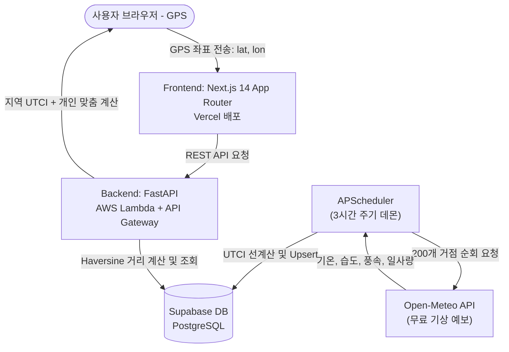

# PROJECT SPEC — 초개인화 체감 기반 의류 추천 서비스 (PCRS)
> **Personalized Climate-based Recommendation Service**
> v3.2 | 핵심 지수: UTCI(지역) + PMV/SET*(개인 맞춤) 결합 및 배치 아키텍처

---

## 0. 문서 목적

이 문서는 **PCRS 1차 개발 완료(MVP)**의 범위, UI/UX 방향, 기술 아키텍처, 핵심 비즈니스 로직을 정의하는 **프로젝트 유일한 진실의 원천(SSOT)**입니다.

> [!IMPORTANT]
> **궁극의 목표**: 사용자의 신체 스펙(키·체중·체지방률·성별·나이)과 실시간 기상 데이터를 결합하여, "오늘 나는 어떤 옷을 입어야 하는가?"에 대한 **초개인화 의류 추천** 및 **활동 맞춤형 열환경 안전 가이드(넛지)**를 제공하는 B2C 웹 서비스.
>
> **1차 개발 완료 기준**: 핵심 5개 기능(신체 스펙 설정 → 위치 설정 → 체감 분석 → AI 추천 → 시간대별 분석)이 End-to-End로 동작하는 **모바일 퍼스트 반응형 웹앱**.

---

## 1. 프로젝트 개요

### 1.1 서비스 핵심 가치 (Why)

*   **기존 날씨 앱의 한계**: "오늘 기온 28°C"와 같이 일방적인 기상 정보만 제공하며, 개개인의 신체 특성이나 활동 상태(예: 단순히 걷는 사람 vs 자전거 타는 사람)에 따른 실제 체감과 건강 위험도를 반영하지 못함.
*   **PCRS의 차별점 (투 트랙 체감 온도 시스템)**:
    1.  **지역 기준 체감 (UTCI)**: Open-Meteo의 기온, 습도, 풍속, 일사량 데이터를 조합하여 야외 활동 기준의 객관적 체감 온도를 도출.
    2.  **개인 맞춤형 체감 (PMV/SET*)**: 사용자의 신체 스펙(나이, 성별, 체지방률)과 행동 상태(출퇴근 보행, 자전거 라이딩 등)를 반영하여 실제 몸이 받는 온열 스트레스를 계산하고 위험을 예방하는 **맞춤형 넛지(Nudge) 메시지** 제공.

### 1.2 아키텍처 의사결정: Open-Meteo + 백엔드 배치(APScheduler) 도입 이유

*   **Rate Limit 극복 및 성능 극대화**: 사용자가 앱을 켤 때마다 외부 API(Open-Meteo)를 호출하면 1) 호출 속도가 느리고(0.5~1초 레이턴시), 2) 하루 10,000회 호출 제한을 초과할 수 있습니다.
*   **해결책 (이원화 배치 구조)**:
    *   **백엔드 내부**: FastAPI 내에 `APScheduler`를 등록하여, 3시간 주기로 전국 주요 거점 200여 개의 위경도 좌표에 대해 Open-Meteo API 예보 데이터를 긁어와 DB에 적재하고 UTCI를 일괄 선계산(Pre-calculate)해 둡니다.
    *   **프론트엔드/API 요청**: 사용자가 GPS 좌표를 담아 API 요청을 보내면 백엔드는 **Haversine 공식**을 통해 DB 내 가장 가까운 거점을 매핑하여 즉시(0.05초 미만) 응답합니다. 대규모 사용자가 몰려도 Open-Meteo API 호출 부하가 전혀 늘어나지 않습니다.

---

## 2. 1차 MVP 기능 명세

### 2.1 핵심 기능 5종 (Must-Have)

| # | 기능명 | 설명 | 구현 상태 |
|:---:|:---|:---|:---:|
| F1 | **개인 신체 스펙 & 활동 설정** | 키, 체중, 체지방률, 성별, 나이, **행동 상태**(보행/라이딩 등) 입력 | 🔲 미완 |
| F2 | **현재 위치 좌표 전송** | 브라우저 GPS 자동감지 좌표 기반으로 가장 가까운 거점 매핑 | 🔲 미완 |
| F3 | **지역 vs 개인 체감 분석** | 객관적 UTCI와 개인 맞춤형 체감(PMV/SET*) 비교 분석 | 🔲 미완 |
| F4 | **초개인화 의류 & 넛지 솔루션** | 체감 등급에 맞는 옷차림 가이드 + **안전 넛지 가이드 팝업** | 🔲 미완 |
| F5 | **시간대별 체감 분석** | 오늘 24시간 지역 UTCI 추이 시각화 (라인 차트) | 🔲 미완 |

### 2.2 2차 기능 (Nice-to-Have / 1차 이후)

*   **F6 피드백 기반 성향 학습**: 사용자의 '추움/더움' 피드백을 수집하여 향후 추천 CLO에 바이어스 자동 적용.
*   **F7 위치 즐겨찾기**: 자주 가는 거점 저장 및 빠른 날씨 전환.
*   **F8 홈 화면 위젯**: 넛지 카드와 옷차림 상태를 요약 제공하는 PWA 위젯.

---

## 3. UI/UX 설계 (1차 MVP)

### 3.1 디자인 원칙

1.  **정보 위계 우선**: 오늘 지역의 객관적 체감 날씨를 상단에 노출하고, 활동 상태에 따른 개인 맞춤 경고(넛지)를 시각적으로 강조.
2.  **모바일 퍼스트**: 375px 세로 스택 레이아웃, 반투명 글래스모피즘 디자인 활용.
3.  **넛지 중심 설계**: 개인화 온도 격차가 벌어지면 메인 상단에 눈에 띄는 "경고 넛지 배너/팝업"을 노출하여 위험 인지 유도.

### 3.2 핵심 화면 프로토타입

#### 화면 1: 홈 탭 (`/app`)

```
┌─────────────────────────────────┐
│  📍 서울 영등포구 여의도동        │
├─────────────────────────────────┤
│         🌡️ 지역 체감 온도        │
│          UTCI 30.5°C            │
│       🟡 보통 열 스트레스        │
│                                 │
│   기온 29°C  습도 75%  바람 1.5  │
├─────────────────────────────────┤
│  🚨 개인 맞춤 안전 넛지           │
│  ┌────────────────────────────┐ │
│  │ "자전거 라이딩(4.0 MET) 중인 │ │  ← 개인 맞춤 계산(SET*/PMV)
│  │ 회원님의 체감 온도는 34.2°C │ │    격차 발생 시 동적 배너 노출
│  │ 수준입니다. (강한 열 위험!)"│ │
│  └────────────────────────────┘ │
├─────────────────────────────────┤
│  오늘의 추천 옷차림               │
│  ┌──────────┐  ┌──────────┐     │
│  │  👕 반팔  │  │ 🧴 자외선 │     │
│  │  린넨 소재│  │ 차단제 필 │     │
│  └──────────┘  └──────────┘     │
└─────────────────────────────────┘
```

---

## 4. 기술 아키텍처 및 데이터 흐름

### 4.1 시스템 아키텍처



### 4.2 API 엔드포인트 명세 (1차 MVP)

| Method | Path | 파라미터 | 역할 |
|:---:|:---|:---|:---|
| `GET` | `/health` | 없음 | 서버 상태 확인 |
| `POST` | `/api/v1/recommend` | `latitude`, `longitude`, `profile` | **지역 UTCI + 개인 맞춤 추천(넛지 포함) 반환** |
| `GET` | `/api/v1/forecast` | `latitude`, `longitude` | 거점의 24시간/7일치 예보 데이터 리스트 |

---

## 5. 핵심 비즈니스 로직 표준

### 5.1 지역 체감 지수 (UTCI)

*   **배치 주기**: 3시간마다 백엔드 내부 스케줄러가 전국 200여 개 거점 좌표 순회.
*   **계산 인자**: 기온(`tdb`), 상대습도(`rh`), 풍속(`v`), 단파 일사량(`shortwave_radiation`).
*   **평균 복사 온도(Tmrt) 정밀식**:
    $$	ext{Tmrt} = 	ext{tdb} + 0.0014 	imes 	ext{shortwave\_radiation (W/m²)}$$
*   **UTCI 다항식**: `utci_pure.py` (Bröde et al. 2012)를 사용해 시간별 UTCI를 선계산하여 DB에 적재.

### 5.2 개인 맞춤형 체감 지수 (PMV/SET*) 및 넛지 엔진

백엔드 API(`POST /api/v1/recommend`)가 요청을 받았을 때 동작하는 실시간 계산 로직입니다.

1.  **입력**: 사용자의 신체 조건(나이, 성별, 체지방률) 및 **활동 수준(activity_level)**.
2.  **대사량(MET) 매핑**:
    *   `sedentary` (휴식/정적): 1.0 MET
    *   `walking` (가벼운 보행): 2.0 MET
    *   `cycling` (자전거 라이딩): 4.0 MET
    *   `running` (달리기/운동): 6.0 MET
3.  **개인화 체감 지수 계산**:
    *   사용자의 성별/체지방률 보정치를 대사량(MET)과 의류 단열계수(CLO)에 적용하여 PMV 또는 간이 SET*를 계산합니다.
4.  **넛지 조건 판정**:
    *   $	ext{개인 맞춤 체감} - 	ext{지역 표준 UTCI} \ge 3.0^\circ	ext{C}$ 이거나 개인 맞춤 체감이 **'강한 열 스트레스'(32°C 이상)**에 도달하는 경우 **경고 넛지 플래그(`nudge_warning: true`)**와 메시지를 생성하여 프론트엔드로 함께 전달합니다.

---

## 6. 데이터베이스 스키마

### 6.1 거점 테이블 (`location_dimension`)

전국 주요 시·군·구 거점 약 150~200개의 중심 좌표 정보입니다.

```sql
CREATE TABLE IF NOT EXISTS location_dimension (
    id          SERIAL PRIMARY KEY,
    sido        VARCHAR(50) NOT NULL,
    sigungu     VARCHAR(50) NOT NULL,
    latitude    NUMERIC(9, 6) NOT NULL,
    longitude   NUMERIC(9, 6) NOT NULL,
    UNIQUE(sido, sigungu)
);
```

### 6.2 기상 및 UTCI 예보 캐시 테이블 (`weather_forecast_cache`)

배치 스케줄러가 3시간 주기로 Open-Meteo 데이터를 가져와 UTCI를 미리 계산한 후 저장해 두는 테이블입니다.

```sql
CREATE TABLE IF NOT EXISTS weather_forecast_cache (
    location_id   INTEGER REFERENCES location_dimension(id) ON DELETE CASCADE PRIMARY KEY,
    forecast_date DATE NOT NULL,              -- 예보일 (YYYY-MM-DD)
    hourly_data   JSONB NOT NULL,             -- 24시간 시간별 기온, 습도, 풍속, 일사량, UTCI 배열
    updated_at    TIMESTAMPTZ DEFAULT NOW()
);
```

---

## 7. 1차 개발 완료 기준 (Definition of Done)

*   [ ] **배치 스케줄러**: FastAPI 데몬(APScheduler)이 200개 거점을 순회하며 3시간 주기로 데이터를 긁어와 `weather_forecast_cache`에 선계산된 UTCI를 Upsert하는지 여부.
*   [ ] **최단거리 매핑 API**: GPS 좌표 수신 시 Haversine 공식을 사용해 최단거리 거점을 매핑하여 0.05초 이내에 시간별 UTCI 예보 데이터를 응답하는지 여부.
*   [ ] **개인화 넛지 계산**: 활동 대사량(MET) 및 신체 스펙을 기반으로 개인 체감을 별도 계산하여 격차 발생 시 넛지 플래그 및 안내문구를 응답하는지 여부.
*   [ ] **반응형 UI**: 하단 탭 내비게이션(홈/시간별/의류/설정)을 갖추고 모바일 해상도에서 넛지 배너와 옷차림 정보가 깨짐 없이 정상 렌더링되는지 여부.
