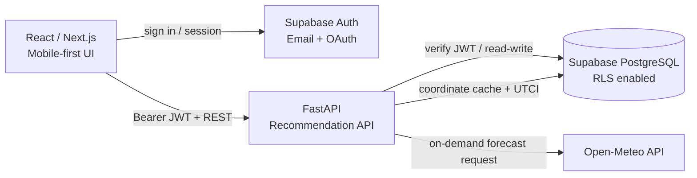

# PCRS 제품·기술 설계서

> **Personalized Climate-based Recommendation Service**
> 개인의 신체 특성, 체감 피드백, 활동 계획, 실내·외 환경을 바탕으로 의류와 활동 시점을 추천하는 기상 서비스
> 버전 4.0 · 2026-07-15

---

## 1. 문서 목적과 제품 원칙

이 문서는 PCRS의 제품 범위, 사용자 경험, 회원 기능, 데이터 모델, API, 보안 원칙과 개발 순서를 정의하는 단일 기준 문서(SSOT)다. 프론트엔드는 React 기반 Next.js, 백엔드는 Python FastAPI, 데이터·인증은 Supabase를 사용한다.

### 1.1 해결하려는 문제

일반 날씨 앱은 기온과 강수 확률을 보여 주지만, 사용자가 실제로 궁금한 질문에는 충분히 답하지 못한다.

- 지금 외출할 때 무엇을 입어야 하는가?
- 운동·산책·출퇴근은 언제 하는 편이 편안하고 안전한가?
- 밖은 덥지만 냉방이 강한 실내에 오래 있을 때 무엇을 챙겨야 하는가?
- 같은 날씨에도 나에게는 왜 덥거나 추운가?

PCRS는 UTCI와 개인화 체감 모델(PMV/SET* 보정)을 기반으로, **사용자의 옷장에 있는 의류 조합**과 **활동별 최적 시간**을 제안한다. 사용자의 “더웠어요 / 적당했어요 / 추웠어요” 피드백으로 추천을 점진적으로 보정한다.

### 1.2 제품 원칙

1. **추천 우선**: 수치보다 “반팔 + 얇은 셔츠, 우산 권장”처럼 바로 행동할 수 있는 결과를 먼저 보여 준다.
2. **개인화는 선택적이고 투명하게**: 가입에는 최소 정보만 요구하고, 신체 정보·실내 환경·의류 정보는 추천 정확도를 높이는 선택 입력으로 취급한다.
3. **실내외를 함께 고려**: 외출, 실내 활동, 출퇴근, 실내외 혼합을 별도 시나리오로 다룬다.
4. **설명 가능한 추천**: 추천 결과에 기온, 바람, 강수, 활동 강도, 개인 보정값 중 영향을 준 요인을 표시한다.
5. **건강 진단이 아님**: 의류·활동 참고 정보이며 의료 조언이나 안전 보장을 제공하지 않는다.

---

## 2. 사용자와 핵심 시나리오

### 2.1 사용자 유형

| 유형 | 목표 | 대표 상황 |
|---|---|---|
| 빠른 확인 사용자 | 지금 입을 옷을 즉시 확인 | 출근 전 10초 확인 |
| 계획형 활동 사용자 | 운동·산책에 좋은 시간을 선택 | 오늘 저녁 러닝 시간 비교 |
| 실내외 혼합 사용자 | 냉난방과 외부 날씨를 동시에 대응 | 더운 외부와 차가운 사무실 이동 |
| 개인화 사용자 | 자신의 옷장과 체감에 맞는 추천 | 보유 아우터 중 하나를 선택 |

### 2.2 핵심 사용자 여정

1. 사용자는 이메일 또는 소셜 계정으로 가입한다.
2. 가입 직후 최소 프로필을 입력하거나 건너뛴다.
3. 홈에서 위치, 활동, 환경을 고른 뒤 ‘오늘의 착장’과 주의사항을 본다.
4. 필요하면 시간별 탭에서 활동에 좋은 시간을 비교한다.
5. 의류 탭에서 보유 의류를 등록하고 추천 조합을 자신의 옷으로 좁힌다.
6. 활동 후 체감 피드백을 남긴다. 이후 추천에는 개인 보정값이 반영된다.

---

## 3. 정보 구조와 하단 탭

모바일 우선 UI를 사용하며 `/app`의 하단 탭은 실제 독립 기능을 제공한다. 탭 전환은 상태를 유지하고, 상세 화면은 모달 또는 하위 경로로 연다.

| 탭 | 사용자 질문 | MVP 기능 | 이후 확장 |
|---|---|---|---|
| 홈 | 지금 무엇을 입을까? | 현재 위치·시간의 날씨, 체감 상태, 오늘의 착장, 우산/자외선/강풍 주의, 피드백 | 즐겨찾는 장소별 요약, 위젯 |
| 시간별 | 언제 활동하면 좋을까? | 시간대별 체감온도·강수·바람 그래프, 활동별 적합도 | 캘린더 연동, 일정별 자동 제안 |
| 의류 | 내 옷 중 무엇을 입을까? | 옷장 등록, 카테고리·보온성·방수성 관리, 추천 조합 | 사진 인식 등록, 세탁/착용 기록 |
| 설정 | 어떻게 개인화할까? | 계정·프로필·활동 기본값·실내 환경·알림·데이터 관리 | 가족 프로필, 다중 기기 설정 |

### 3.1 홈: 오늘의 착장

홈은 분석 대시보드가 아니라 결정을 돕는 화면이다.

1. 위치 선택(GPS/즐겨찾기)과 시나리오 선택: `외부 활동`, `실내 활동`, `출퇴근`, `실내외 혼합`
2. 현재 기상 요약: 기온, 체감온도, 습도, 바람, 강수, 자외선
3. 오늘의 착장 카드: 상의·하의·아우터·신발·소품 및 레이어링 팁
4. 이유: 예) “습도가 높고 걷기 활동을 선택해 실제 체감이 높습니다.”
5. 주의 카드: 우산, 자외선 차단, 수분 섭취, 한파/폭염/강풍
6. 피드백: `더웠어요`, `적당했어요`, `추웠어요`와 선택적 메모

추천은 다음 우선순위를 가진다.

1. 사용자의 보유 의류 중 조건을 충족하는 조합
2. 보유 의류가 부족하거나 비회원인 경우 일반 카테고리 조합
3. 실내외 혼합이면 탈착 가능한 레이어를 우선
4. 위험 기상에서는 패션보다 안전 소품(우산, 방수, 모자 등)을 우선

### 3.2 시간별: 활동 계획

- 활동 유형: 가벼운 걷기, 출퇴근, 러닝, 자전거, 야외 작업, 실내 운동
- 각 시간에 `좋음`, `보통`, `주의`, `피함` 등급과 근거를 표시한다.
- 점수는 기온, UTCI, 강수, 풍속, 자외선, 활동 강도(MET), 개인 보정값으로 계산한다.
- 사용자는 출발 시간과 예상 체류 시간을 선택해 해당 구간의 의류 조합을 다시 계산할 수 있다.

### 3.3 의류: 개인 옷장

의류 등록은 빠르게 시작할 수 있어야 한다. MVP에서는 사진 없이 카테고리와 속성만 입력하고, 사진은 선택으로 둔다.

| 분류 | 예시 속성 |
|---|---|
| 상의 | 반팔, 긴팔, 셔츠, 니트, 기능성 / 보온성 / 통기성 |
| 하의 | 반바지, 긴바지, 레깅스 / 두께 / 방풍성 |
| 아우터 | 가디건, 바람막이, 재킷, 패딩 / 보온성 / 방수성 / 휴대성 |
| 신발·소품 | 운동화, 방수화, 우산, 모자, 장갑 / 방수성 / 자외선 차단 |

- 사용자는 즐겨 입는 옷, 계절 사용 여부, 세탁 중 여부를 설정할 수 있다.
- 추천 결과에는 ‘보유 의류로 구성됨’ 여부를 표시한다.
- 삭제된 의류는 미래 추천에서 즉시 제외한다.

### 3.4 설정: 개인화와 계정

- 계정: 이메일, 연결된 소셜 계정, 비밀번호, 로그아웃, 계정 삭제
- 신체 프로필: 키, 몸무게, 체지방률, 출생 연도, 성별(선택), 추위/더위 민감도
- 활동 기본값: 기본 활동, 활동 강도, 실내외 시나리오
- 실내 환경: 냉난방 온도, 실내 체류 시간, 냉방 민감도
- 위치·알림: GPS 권한, 즐겨찾는 장소, 폭염·한파·강수·활동 알림
- 데이터: 피드백 초기화, 데이터 내보내기, 계정 삭제

---

## 4. 회원가입 및 계정 관리 설계

### 4.1 인증 방식

Supabase Auth를 인증 원천으로 사용한다. 프론트엔드는 Supabase SDK로 세션을 관리하고, FastAPI는 전달받은 Bearer JWT를 검증한 후 사용자 ID(`auth.users.id`)를 신뢰한다.

| 방식 | 지원 | 필수 입력 | 비고 |
|---|---:|---|---|
| 이메일·비밀번호 | MVP | 이메일, 비밀번호 | 이메일 인증을 기본 활성화 |
| Google OAuth | MVP | 제공자 동의 | 이메일 중복 시 계정 연결 흐름 제공 |
| Kakao OAuth | 2차 | 제공자 동의 | 국내 사용자 편의성 검토 후 추가 |
| Apple OAuth | 2차 | 제공자 동의 | iOS/PWA 배포 전략 확정 후 추가 |

소셜 로그인은 비밀번호를 저장하지 않는다. 사용자가 소셜 전용 계정에 비밀번호 로그인을 추가하려면 이메일 인증 후 ‘비밀번호 설정’을 진행한다.

### 4.2 가입 단계

#### 단계 1: 계정 생성 — 필수

- 이메일 ID
- 비밀번호: 8자 이상, 영문·숫자·기호 중 2종 이상 권장. 서버/클라이언트에서 강도 안내.
- 이용약관 및 개인정보 처리방침 동의: 필수
- 마케팅 수신 동의: 선택, 기본 미동의
- 이메일 인증 완료 후 로그인 허용

#### 단계 2: 개인화 시작 — 선택

정확한 추천을 위해 아래 항목을 입력받되, 모두 건너뛸 수 있다. 미입력 값은 일반 추천에만 사용하며 추정값을 저장하지 않는다.

| 항목 | 저장 형식 | 추천 활용 | 검증 |
|---|---|---|---|
| 키 | cm | 체표면적·개인 보정 | 100–250 |
| 몸무게 | kg | 체표면적·개인 보정 | 25–300 |
| 체지방률 | % | 체감 보정 보조값 | 3–70 |
| 출생 연도 | year | 연령대 보정 | 현재 연도 기준 14–120세 |
| 성별 | 선택 enum | 모델 보정에 동의한 경우만 | 여성/남성/응답 안 함 |

체지방률은 ‘체지방량’보다 비교 가능한 `체지방률(%)`로 수집한다. 체지방량(kg)이 필요한 경우 몸무게와 함께 계산할 수 있지만, 원본 입력은 사용자가 이해하기 쉬운 비율을 권장한다.

#### 단계 3: 빠른 설정 — 선택

- 기본 활동(걷기/출퇴근/러닝 등)
- 추위/더위 민감도 5단계
- 실내 냉난방 온도 범위
- 위치 권한 및 기상 알림 동의

### 4.3 수정, 비밀번호 변경, 삭제

| 기능 | 요구 사항 |
|---|---|
| 프로필 수정 | 인증된 사용자는 자신의 선택 정보·기본 활동·민감도를 언제든 수정할 수 있다. 수정 즉시 다음 추천부터 반영한다. |
| 이메일 변경 | 새 이메일 확인 링크로 인증 후 변경한다. 최근 로그인 또는 재인증을 요구한다. |
| 비밀번호 변경 | 기존 비밀번호 재입력 또는 최근 OAuth 재인증 후 새 비밀번호를 설정한다. 비밀번호 재설정 메일도 지원한다. |
| 소셜 계정 연결/해제 | 최소 하나의 로그인 수단은 유지해야 한다. 마지막 로그인 수단 해제는 차단한다. |
| 로그아웃 | 현재 기기 로그아웃과 모든 기기 로그아웃을 구분한다. |
| 계정 삭제 | 확인 문구 입력 및 최근 재인증 후 실행한다. 30일 유예 삭제(복구 가능)를 기본으로 하며, 유예 종료 시 개인정보·옷장·피드백·즐겨찾기를 삭제 또는 익명화한다. |
| 데이터 내보내기 | 프로필, 의류, 피드백, 추천 이력을 JSON/CSV로 다운로드할 수 있다. |

### 4.4 개인정보와 동의 원칙

- GPS는 요청 시점의 추천에만 사용하고, 위치 이력 저장은 별도 동의가 있어야 한다.
- 신체 정보는 개인화 목적 외에 사용하지 않으며 마케팅·광고 타기팅에 사용하지 않는다.
- 민감한 정보는 필요한 최소 범위만 저장하고, 분석 로그에는 원본 신체 값을 남기지 않는다.
- 약관, 개인정보 처리방침, 마케팅 동의의 버전과 동의 시각을 기록한다.
- 미성년 사용자 지원 정책과 최소 연령은 출시 지역 법률 검토 후 확정한다. MVP는 14세 미만 가입을 차단하는 방안을 권장한다.

---

## 5. 개인화 및 추천 엔진

### 5.1 입력

| 범주 | 값 | 출처 |
|---|---|---|
| 날씨 | 기온, 습도, 풍속, 강수, 일사량, 자외선 | Open-Meteo 캐시 |
| 위치·시간 | 좌표, 장소, 출발·체류 시간 | GPS/사용자 입력 |
| 활동 | 활동 유형, MET, 실내·외 환경 | 사용자 선택 |
| 개인 | 신체 정보, 민감도, 피드백 보정 | profile, feedback |
| 의류 | 카테고리, 보온성, 통기성, 방수성, 사용 가능 여부 | wardrobe_items |

### 5.2 계산 흐름

1. 좌표에 가장 가까운 기상 관측·예보 캐시를 찾는다.
2. UTCI를 계산하거나 캐시된 시간별 UTCI를 읽는다.
3. 활동의 MET, 환경, 개인 보정값으로 PMV/SET* 기반 개인 체감을 계산한다.
4. 기상 위험도를 판정한다. 강수·강풍·폭염·한파·자외선은 별도 규칙으로 가중한다.
5. 적정 CLO 범위와 의류 속성을 산출한다.
6. 사용자 옷장에서 조건을 충족하는 조합을 점수화한다. 없으면 일반 조합을 반환한다.
7. 결과·근거·신뢰도·주의사항을 API 응답으로 반환한다.

### 5.3 피드백 학습

- 피드백 값: `too_cold`, `comfortable`, `too_hot`
- 동일 조건(계절, 활동, 환경)에서 누적 피드백을 사용해 개인 체감 보정값을 완만하게 조정한다.
- 사용자가 피드백을 삭제하거나 초기화할 수 있어야 한다.
- 초기에는 설명 가능한 규칙 기반 보정으로 구현하고, 충분한 데이터가 쌓인 뒤 통계/ML 모델 도입 여부를 판단한다.

---

## 6. 시스템 아키텍처



### 6.1 책임 분리

| 계층 | 책임 |
|---|---|
| React / Next.js | UI, 폼 검증, Supabase 로그인, 세션 갱신, 위치 권한, FastAPI 호출 |
| FastAPI | JWT 검증, 추천 계산, 옷장 조합 점수화, 기상 캐시 조회, 도메인 검증, 감사 로그 |
| Supabase Auth | 계정, 이메일 인증, OAuth, 비밀번호 재설정, 세션 |
| Supabase PostgreSQL | 사용자 데이터, 옷장, 피드백, 장소, 기상 캐시, RLS 정책 |
| Scheduler | 계정 삭제 유예 처리 등 정기 운영 작업 |

### 6.2 기상 데이터 전략

- Open-Meteo는 정규화한 좌표 캐시가 없거나 만료된 경우에만 호출한다.
- 가까운 GPS 좌표는 소수점 둘째 자리 좌표 셀을 공유하며, `coordinate_weather_forecast_cache`에 1~3시간 저장한다.
- 장소 이름은 표시·저장용이고, 예보 조회와 캐시 키는 위도·경도를 기준으로 한다.
- 캐시 만료·API 장애 시 마지막 정상 데이터와 갱신 시각을 명시한다.
- 비정상 위치 또는 캐시 부재 시 제한된 실시간 호출을 하되, 시간 초과와 재시도 정책을 둔다.

---

## 7. 데이터 모델

`auth.users`는 Supabase Auth가 관리한다. 서비스 테이블의 `user_id`는 `auth.users.id`를 참조하고, 모든 개인 테이블에는 RLS를 활성화한다.

| 테이블 | 연결된 화면 기능 | 역할 |
|---|---|---|
| profiles | 설정 > 선택 개인화 정보 | 키·몸무게·체지방률·출생연도·활동·실내외 환경을 보관하고 추천 계산에 적용한다. |
| user_consents | 회원가입 동의, 설정 | 약관·개인정보 처리방침·마케팅 수신 동의와 정책 버전을 보관한다. |
| wardrobe_items | 옷장 탭 | 보유 의류와 보온성·방수·계절·세탁 상태를 저장하고 맞춤 착장에 우선 반영한다. |
| recommendation_feedback | 홈 > 추천 체감 피드백 | 추움·좋음·더움 피드백을 저장해 이후 보온 선호를 조금씩 보정한다. |
| user_locations | 홈 > 장소 선택 시트, 설정 > 즐겨찾는 장소 | 사용자가 저장한 장소 좌표를 보관해 해당 지역 분석을 빠르게 다시 연다. |
| account_deletion_requests | 설정 > 데이터 및 계정 삭제 | 삭제 요청, 30일 유예 시점, 취소 여부를 관리한다. |
| coordinate_weather_forecast_cache | 홈, 시간별 활동 탭 | 정규화된 위도·경도별 Open-Meteo 시간대 예보와 UTCI 결과를 서버 전용으로 캐시한다. |
| personalized_coordinate_analysis_cache | 홈, 시간별 활동 탭 | 사용자·좌표 셀·프로필 입력별 추천 결과를 서버 전용으로 캐시한다. |

`006_schema_cleanup_and_table_descriptions.sql`은 기존 테이블 설명과 레거시 정리를 담당한다. `010_coordinate_weather_cache.sql` 적용 뒤에는 좌표 캐시가 운영 경로를 담당하며, 기존 지역 기반 캐시는 별도 검토 후 제거한다.

### 7.1 핵심 스키마 예시

```sql
create table public.profiles (
  user_id uuid primary key references auth.users(id) on delete cascade,
  height_cm numeric(5, 1) check (height_cm between 100 and 250),
  weight_kg numeric(5, 1) check (weight_kg between 25 and 300),
  body_fat_pct numeric(4, 1) check (body_fat_pct between 3 and 70),
  birth_year smallint,
  sex text check (sex in ('female', 'male', 'undisclosed')),
  thermal_sensitivity smallint not null default 0 check (thermal_sensitivity between -2 and 2),
  default_activity text not null default 'walking',
  indoor_temperature_c numeric(4, 1),
  created_at timestamptz not null default now(),
  updated_at timestamptz not null default now()
);

create table public.wardrobe_items (
  id uuid primary key default gen_random_uuid(),
  user_id uuid not null references auth.users(id) on delete cascade,
  category text not null check (category in ('top', 'bottom', 'outerwear', 'shoes', 'accessory')),
  subcategory text not null,
  name text not null,
  warmth_level smallint not null check (warmth_level between 1 and 5),
  breathability smallint check (breathability between 1 and 5),
  water_resistance smallint check (water_resistance between 1 and 5),
  is_available boolean not null default true,
  created_at timestamptz not null default now(),
  updated_at timestamptz not null default now()
);

alter table public.profiles enable row level security;
alter table public.wardrobe_items enable row level security;

create policy "users manage own profile" on public.profiles
  for all using (auth.uid() = user_id) with check (auth.uid() = user_id);

create policy "users manage own wardrobe" on public.wardrobe_items
  for all using (auth.uid() = user_id) with check (auth.uid() = user_id);
```

FastAPI의 서비스 키는 RLS를 우회할 수 있으므로 브라우저에 절대 노출하지 않는다. 서비스 키 사용 API는 JWT의 사용자 ID로 소유권을 재검증한다.

---

## 8. FastAPI API 설계

모든 `/api/v1/me/*` 경로는 `Authorization: Bearer <supabase-access-token>`을 요구한다. 요청·응답은 Pydantic 모델로 명시하고, 오류는 `{ code, message, details }` 형식으로 반환한다.

| Method | Path | 인증 | 역할 |
|---|---|---:|---|
| GET | `/health` | 아니오 | 서버 상태 확인 |
| POST | `/api/v1/recommendations` | 예 | 보유 의류·피드백을 반영한 현재 조건의 의류·주의·근거 추천 |
| GET | `/api/v1/forecast` | 선택 | 위치·날짜 기준 시간별 예보와 활동 적합도 |
| GET/PATCH | `/api/v1/me/profile` | 예 | 프로필 조회·수정 |
| GET/POST | `/api/v1/me/wardrobe` | 예 | 옷장 조회·등록 |
| PATCH/DELETE | `/api/v1/me/wardrobe/{item_id}` | 예 | 의류 수정·삭제 |
| GET/POST | `/api/v1/me/locations` | 예 | 장소 조회·등록 |
| PATCH/DELETE | `/api/v1/me/locations/{location_id}` | 예 | 장소 수정·삭제 |
| POST/DELETE | `/api/v1/me/recommendation-feedback` | 예 | 체감 피드백 등록·초기화 |
| GET | `/api/v1/me/data-export` | 예 | 개인 데이터 JSON 내보내기 |
| POST | `/api/v1/me/deletion-request` | 예 | 계정 삭제 유예 요청 |
| DELETE | `/api/v1/me/deletion-request` | 예 | 유예 기간 내 삭제 취소 |

### 8.1 추천 요청 예시

```json
{
  "latitude": 37.5264,
  "longitude": 126.8962,
  "activity": "walking",
  "environment": "mixed",
  "departure_at": "2026-07-15T18:30:00+09:00",
  "duration_minutes": 90,
  "indoor_temperature_c": 22
}
```

```json
{
  "weather": { "temperature_c": 28.4, "utci_c": 31.2, "rain_probability": 30 },
  "personal_sensation": { "value_c": 33.1, "label": "더움", "confidence": "medium" },
  "outfit": {
    "source": "wardrobe",
    "items": ["기능성 반팔", "얇은 긴바지", "휴대 가능한 가디건"],
    "layering_tip": "냉방 실내에서는 가디건을 입고, 야외에서는 벗으세요."
  },
  "alerts": ["자외선이 높아 모자 또는 자외선 차단제를 권장합니다."],
  "reasons": ["걷기 활동", "높은 습도", "실내외 혼합 일정"]
}
```

---

## 9. 보안·운영·품질 기준

### 9.1 보안

- Supabase RLS를 모든 사용자 데이터 테이블에서 활성화한다.
- `SUPABASE_SERVICE_ROLE_KEY`, Open-Meteo 키 등 비밀값은 서버 환경 변수로만 관리한다.
- FastAPI는 JWT의 서명, issuer, audience, 만료를 검증한다.
- 인증·추천·계정 삭제 API에 rate limit을 둔다.
- 계정 복구·이메일 변경·삭제는 최근 로그인 또는 재인증을 요구한다.
- 감사 로그에는 이메일, 좌표, 신체 정보 원문을 기록하지 않는다.

### 9.2 품질과 관측성

- 추천 API p95 응답 목표: 캐시 적중 시 500ms 이하
- 기상 캐시 갱신 실패, 추천 오류율, OAuth 실패, 계정 삭제 작업 실패를 모니터링한다.
- 추천 결과에는 모델/규칙 버전을 기록해 변경 전후를 비교한다.
- 계산 로직은 날씨·활동·의류 조건별 단위 테스트를 작성한다.
- 로그인, 프로필 수정, 의류 CRUD, 피드백, 계정 삭제는 E2E 테스트 범위에 포함한다.

---

## 10. 개발 로드맵과 완료 기준

### Phase 1 — 기반과 인증

- Supabase Auth: 이메일 인증, 비밀번호 재설정, Google OAuth
- profiles, consents, wardrobe, locations, feedback 테이블 및 RLS
- FastAPI JWT 미들웨어와 `/me/profile` API
- 설정 탭의 계정·개인화 프로필 UI

**완료 기준:** 이메일/Google 가입, 이메일 인증, 로그인, 로그아웃, 비밀번호 재설정, 프로필 수정이 동작하고 다른 사용자의 데이터는 접근할 수 없다.

### Phase 2 — 추천 MVP

- 기상 캐시 배치, UTCI 계산, 추천 API
- 홈 탭의 오늘의 착장·주의·피드백
- 시간별 탭의 활동 적합도
- 비회원 일반 추천과 회원 개인화 추천의 분기

**완료 기준:** 위치·활동·환경을 바꾸면 추천과 근거가 갱신되고, 위험 기상에서 적절한 경고를 보인다.

### Phase 3 — 개인 옷장과 학습

- 의류 CRUD와 조합 추천
- 피드백 기반 개인 보정값
- 즐겨찾는 장소와 기본 활동

**완료 기준:** 등록한 의류가 우선 추천되며, 누적 피드백이 이후 추천에 반영된다.

### Phase 4 — 신뢰와 확장

- 계정 삭제 유예/취소, 데이터 내보내기
- Kakao/Apple OAuth 검토 및 도입
- 알림, PWA, 위젯, 사진 기반 의류 등록

**완료 기준:** 사용자가 자신의 계정과 데이터를 스스로 조회·수정·내보내기·삭제할 수 있다.

---

## 11. 출시 전 결정이 필요한 제안 사항

1. **위치 이력 정책**: 추천용 일회성 GPS와 장기 위치 이력을 분리하고, 이력은 기본 저장하지 않는 것을 권장한다.
2. **성별 입력의 필요성**: 초기 모델에서 실제 정확도 향상이 검증되지 않으면 `응답 안 함`을 기본으로 하고 필수화하지 않는다.
3. **체지방 데이터**: 민감도가 높은 정보이므로 필수 입력으로 만들지 않고, 입력하지 않아도 유용한 추천을 보장한다.
4. **의료·건강 고지**: 폭염·한파 경고는 기상 안전 정보로 표현하고 질병 진단 또는 운동 가능 판정처럼 보이지 않게 한다.
5. **소셜 공급자 우선순위**: MVP는 Google로 시작하고, 실제 타깃 사용자의 플랫폼과 지역을 확인해 Kakao와 Apple을 추가한다.
6. **탈퇴 유예 기간**: 운영·법무 검토 전에는 30일을 기본값으로 두되, 즉시 삭제 요청권이 필요한 지역의 정책을 별도로 검토한다.
