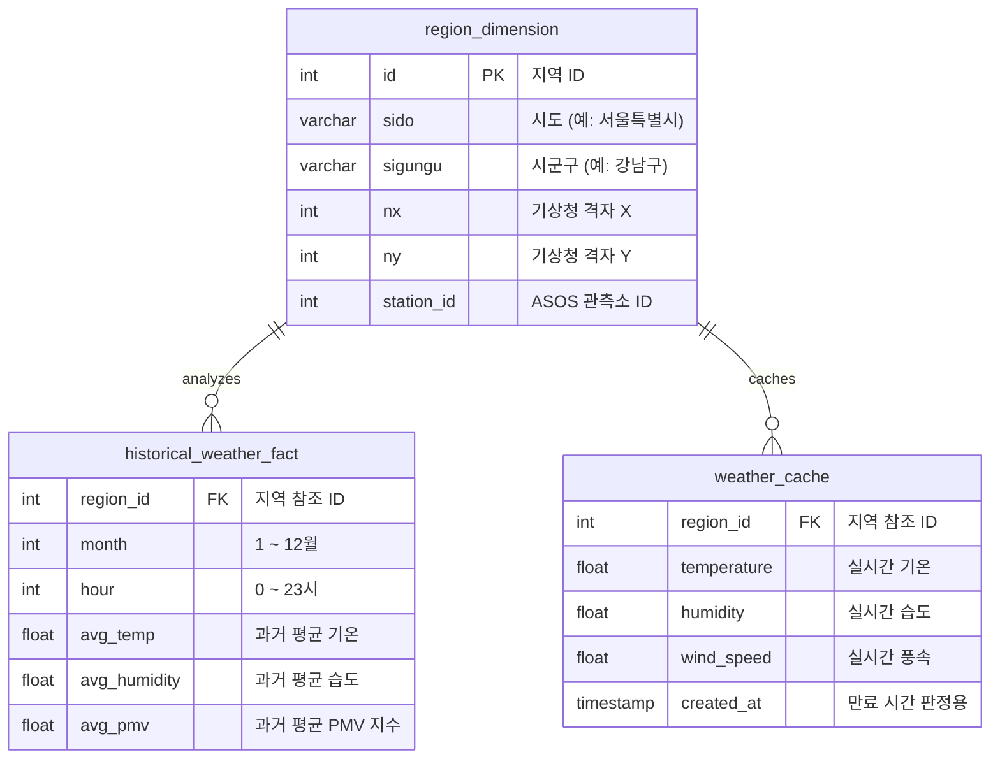

# [Project Specification] 개인 맞춤형 체감 열 부하 데이터 프로덕트 v2.0
> **B2C & 대규모 트래픽 대응 아키텍처**

이 문서는 기존 Streamlit 단일 구조(v1.0)의 한계를 극복하고, 서비스 확장성 및 검색 최적화(SEO)를 달성하기 위한 **개인 맞춤형 체감 열 부하 데이터 프로덕트 v2.0**의 공식 스펙 문서입니다.

---

## 1. 프로젝트 개요 (Overview)

### 1.1 프로젝트 목표
* 사용자의 고유한 신체 스펙(키, 몸무게, 체지방률)과 실시간 기상 데이터를 결합하여 **'개인화된 체감 온도 및 행동/의류 가이드'**를 제공하는 대국민 B2C 웹 애플리케이션을 구축한다.
* 구글 검색 노출(SEO)을 극대화하기 위해 프론트엔드와 백엔드를 완전 분리(Next.js + FastAPI)한다.
* AWS 서버리스 인프라를 적극 활용하여 무중단 배포와 비용 최적화(0원)를 동시에 달성한다.

### 1.2 아키텍처 변경 사유 (v1.0 -> v2.0)
* **SEO 및 트래픽 개선**: 기존 Streamlit 단일 구조가 가지는 SEO 불가 및 트래픽 병목 문제를 해결하기 위해 마이크로서비스 아키텍처(MSA)로 전환한다.
* **데이터 엔지니어링 역할 분리**: 실시간 API 캐싱과 과거 데이터 배치(Batch) 파이프라인의 물리적, 논리적 역할을 명확히 분리하여 데이터 파이프라인의 안정성을 기한다.

---

## 2. 시스템 아키텍처 (System Architecture)

프론트엔드(Vercel), 백엔드(AWS Lambda), 데이터베이스(Supabase), 배치 파이프라인(Apache Airflow 3.2)이 완전히 분리된 현대적인 데이터/서버리스 아택텍처입니다.

```mermaid
graph TD
    User([사용자])
    NextJS[Frontend: Next.js <br> Vercel 배포 / SSR]
    FastAPI[Backend: FastAPI <br> AWS Lambda / API Gateway]
    Supabase[(Data & Cache Layer: Supabase <br> PostgreSQL)]
    Airflow[Batch Pipeline: Apache Airflow 3.2 <br> Local 또는 별도 인스턴스]
    Gemini[LLM 분석 엔진: Gemini Pro]
    WeatherAPI[기상청 API 허브]
    S3[Data Lake: AWS S3 / Supabase Storage]

    User -->|인터랙션| NextJS
    NextJS -->|RESTful API / CORS| FastAPI
    FastAPI -->|On-demand 데이터 Fetching (ASOS 실시간)| WeatherAPI
    FastAPI -->|격자별 데이터 임시 저장 / 캐시 확인| Supabase
    FastAPI -->|정형 데이터 기반 프롬프트 전달| Gemini
    Airflow -->|과거 10년 Raw 벌크 데이터 수집 및 보관| S3
    Airflow -->|과거 데이터 읽기 및 대규모 집계 변환| S3
    Airflow -->|지역별 월/시 집계 요약 마트 적재| Supabase
```

### 2.1 컴포넌트별 상세 스택
1. **Frontend (Next.js - Vercel 배포)**
   * SSR/SSG 기반 랜딩 페이지 구축 (Google 검색 크롤러 완벽 대응).
   * 클라이언트 상태 관리 및 사용자 인터랙션 (지도 연동, 시간 슬라이더 UI 제공).
2. **Backend (FastAPI - AWS Lambda + API Gateway)**
   * API Endpoints: 좌표 변환, 환경 변수 주입, LLM 프롬프트 조립.
   * Cold Start 방어 로직: AWS EventBridge를 통한 5분 주기 Ping(Warm-up).
   * 라이브러리 최적화: 인간공학 계산용 `pythermalcomfort` 등 무거운 패키지 경량화.
3. **Data & Cache Layer (Supabase - Serverless PostgreSQL)**
   * BI 대시보드 시각화용 최종 집계 요약 마트 및 실시간 날씨 격자 캐시만 저장하여 DB 용량 및 성능 최적화 달성.
4. **Data Lake (AWS S3 / Supabase Storage)**
   * 10개년 기상청 ASOS 과거 Raw 데이터 원본 아카이빙 (SQL DB 외부 파일 보관을 통해 SQL 비용 절감).
5. **Batch Data Pipeline (Apache Airflow 3.2 - Local / 별도 인스턴스)**
   * **버전 정보**: **Apache Airflow 3.2** 탑재.
   * DAG 스케줄링: S3에 수집된 데이터에 대해 대규모 집계 연산을 분리 실행한 후, 최종 정제 요약 데이터만을 Supabase DB에 적재.

### 2.2 데이터베이스 스키마 설계 (Star Schema)
데이터베이스의 성능 극대화 및 스토리지 사용량 한계(무료 플랜 500MB) 대응을 위해 스타 스키마 관계형 구조로 설계한다.



---

## 3. 화면 설계서 및 UI/UX 스펙 (Screen & UI/UX Spec)

### 3.1 모바일 및 데스크톱 반응형 웹 디자인
* 데스크톱 환경에서는 리치하고 균형 있는 3개 열(Column) 카드형 구조를 제공하고, 모바일 환경에서는 부드러운 스와이프와 세로 스택 레이아웃을 제공한다.
* **SEO 최적화 랜딩 (`/`)**: 서비스 소개, 핵심 가치, 검색 키워드가 포함된 정적 페이지.
* **메인 대시보드 (`/app`)**: 실제 지도가 렌더링되고 데이터가 연산되는 동적 앱 영역. 최초 접속 시 로딩 속도를 높이기 위해 컴포넌트 지연 로딩(Lazy Loading) 적용.

### 3.2 메인 앱 화면 설계 (피드백 반영 한글 버전)
```
+===========================================================================================================+
| 🌡️ THERMAL GUIDE v2.0                                                        🔔  [👤 김철수 님 (남성)]     |
+===========================================================================================================+
|  [개인 신체 스펙 설정]                       [시간대별 체감 분석]              [실시간 온열 부하 분석]    |
|  * 신장(cm): [181]  * 체중(kg): [78]         17:00  18:00  [19:00]  20:00  21:00  Comfort ====[ Needle ]==== Danger |
|  * 체지방률(%): [16]                                      (현재)                     |       +2.1 PMV       |
|  * 성별: [남성 ◉] [여성  ]                                                      |  [ DANGER(EXTREME HEAT) ] |
|  * 활동 환경: [실내 공조] [실외 자연풍 ◉]                                                                |
|  [분석 결과 업데이트]                                                                                      |
+-----------------------------------------------------------------------------------------------------------+
|  [현재 위치 정보]                            [유사 신체 스펙 추천 가이드]                                 |
|  +---------------------------------------+  +------------------+  +------------------+  +------------------+ |
|  |             (한글 지도)               |  |   [린넨 의류]    |  |   [이온 음료]    |  |   [그늘 야외활동] | |
|  |           [히트맵 레이어]             |  |   (81% 선호)     |  |   (75% 선호)     |  |   (92% 권장)     | |
|  |        📍 서울특별시 강남구           |  +------------------+  +------------------+  +------------------+ |
|  +---------------------------------------+                                                                 |
|  Address: 서울특별시 강남구 역삼동 31                                                                      |
+-----------------------------------------------------------------------------------------------------------+
|  [실시간 AI 맞춤 솔루션]                                                                 Powered by Gemini Pro|
|  +-----------------------------------+  +-----------------------------------+  +-----------------------------------+ |
|  |           의류 권장 가이드        |  |          수분 섭취 가이드         |  |         행동 및 외부 활동         | |
|  | 린넨 셔츠와 통풍이 잘되는 반바지  |  | 땀 배출이 많아 매 시간 250ml      |  | 뙤약볕의 야외 활동을 피하고       | |
|  | 착용을 권장합니다.                |  | 이상의 수분/이온음료를 보충하세요. |  | 주기적인 실내 휴식을 확보하세요.  | |
|  +-----------------------------------+  +-----------------------------------+  +-----------------------------------+ |
+===========================================================================================================+
```

---

## 4. 기능 및 엔지니어링 명세 (Engineering Specifications)

| 엔지니어링 주제 | 상세 설계 내용 및 해결 전략 |
| :--- | :--- |
| **API 서버리스 배포 및 Cold Start 대응** | * FastAPI 애플리케이션을 `Mangum` 라이브러리를 통해 AWS Lambda 핸들러로 래핑.<br>* API Gateway와 연결 시 발생하는 초기 지연(Cold Start)을 최소화하기 위해 AWS EventBridge로 5분마다 더미 요청을 보내는 Warm-up 파이프라인 구성. |
| **상태 관리 및 비동기 통신** | * Next.js 클라이언트에서는 `React Query(TanStack Query)`를 활용하여 FastAPI 서버와의 비동기 데이터 통신 캐싱 및 로딩/에러 상태(Loading/Error State)를 선언적으로 관리. |
| **LLM 분석 엔진 (Gemini Pro)** | * 서버(FastAPI) 단에서만 Gemini API 호출하여 프론트엔드에 API 키 노출 방지.<br>* 프롬프트 인젝션 방어를 위해 사용자 입력 문자열이 아닌 정형 숫자 데이터(온도, 습도, PMV)만 LLM 컨텍스트로 조립 및 전달. |
| **배치(Batch) 및 실시간(RT) 역할 분리** | * **[실시간]** Supabase 하이브리드 캐싱(TTL 1시간 임시 캐시)으로 대응하며 기상청 API 허브를 활용.<br>* **[배치]** **Apache Airflow 3.2**를 활용해 기상청 API 허브 ASOS 10개년 대량 기상 데이터를 수집/가공하여 주기적인 데이터 동기화 및 DB 적재 파이프라인 구축. |

---

## 5. 핵심 비즈니스 로직 표준 (Core Business Logic Standard)

> [!IMPORTANT]
> 이 섹션은 서비스의 **개인화 핵심 로직**에 대한 설계 표준입니다. 다른 모델 또는 개발자가 이 프로젝트를 이어서 작업할 때 반드시 이 표준을 참고하여 일관성을 유지해야 합니다. 임의로 `met`·`clo`를 하드코딩하면 개인화가 무력화됩니다.

### 5.1 개요: PMV (Predicted Mean Vote) 온열지수

이 서비스의 핵심 출력물은 **Fanger PMV 지수**입니다. PMV는 인간의 열 쾌적도를 -3(매우 춥다) ~ +3(매우 덥다) 범위의 숫자로 표현하는 국제 표준(ISO 7730, ASHRAE 55) 지수입니다.

$$PMV = f(M, W, t_a, \bar{t_r}, v_{ar}, p_a, I_{cl})$$

| PMV 구간 | 온열감 | 서비스 출력 (`thermal_sensation`) |
| :---: | :---: | :--- |
| ≥ 2.0 | 매우 더움 | 위험 (극한 더위) |
| 1.0 ~ 2.0 | 더움 | 더움 (주의) |
| -1.0 ~ 1.0 | 쾌적 | 쾌적 (보통) |
| ≤ -1.0 | 추움 | 쌀쌀함 / 추움 |

### 5.2 PMV 연산 입력 인자 표준

PMV 계산 함수 `calculate_pmv(ta, tr, vel, rh, met, clo)`의 각 인자는 다음과 같이 결정됩니다.

| 인자 | 설명 | 결정 방법 | 출처 |
| :---: | :--- | :--- | :--- |
| `ta` | 건구온도 (°C) | 기상청 API 허브 실시간 `TA` 컬럼 | 실시간 관측 |
| `tr` | 평균복사온도 (°C) | 실외: `ta + 5.0` / 실내: `ta` | 환경 타입 파생 |
| `vel` | 풍속 (m/s) | 실외: 기상청 `WS` 컬럼 / 실내: `0.1` | 환경 타입 파생 |
| `rh` | 상대습도 (%) | 기상청 API 허브 실시간 `HM` 컬럼 | 실시간 관측 |
| **`met`** | **대사량 (MET)** | **`calculate_met_from_profile()` 함수** | **개인화 신체 프로필** |
| **`clo`** | **착의 단열계수 (CLO)** | **`calculate_clo_from_weather()` 함수** | **기온 + 개인화** |

> [!WARNING]
> `met`와 `clo`를 `1.2`, `0.5` 등으로 하드코딩하는 것은 **금지**합니다. 하드코딩하면 사용자의 신체 프로필(성별·체지방률·환경)이 계산에 전혀 반영되지 않아 서비스의 개인화 차별화 요소가 사라집니다.

---

### 5.3 대사량 산출 표준: `calculate_met_from_profile(gender, body_fat)`

**기준 규격**: ISO 7730 가벼운 보행(1.2 MET) 기준에 성별 및 체지방률 보정 적용

| 조건 | MET 값 | 설명 |
| :--- | :---: | :--- |
| 남성 / 정상 체지방 | **1.20** | ISO 7730 기본값 |
| 남성 / 고체지방 (체지방률 > 25%) | **1.15** | 대사 활성 조직 비중 감소 |
| 여성 / 정상 체지방 | **1.10** | 여성 기초 대사량 -8% 반영 |
| 여성 / 고체지방 (체지방률 > 32%) | **1.05** | 고체지방 보정 추가 |

```python
def calculate_met_from_profile(gender: str, body_fat: Optional[float]) -> float:
    base_met = 1.2 if gender == "male" else 1.1
    if body_fat is not None:
        high_fat_threshold = 25.0 if gender == "male" else 32.0
        if body_fat > high_fat_threshold:
            base_met -= 0.05
    return round(max(0.8, base_met), 2)
```

---

### 5.4 착의 단열계수 산출 표준: `calculate_clo_from_weather(ta, gender)`

**기준 규격**: ASHRAE 55 / ISO 7730 기반 기온 구간별 CLO 매핑 + 성별 보정

| 기온 구간 | 남성 CLO | 여성 CLO (×0.9) | 착의 설명 |
| :---: | :---: | :---: | :--- |
| ta < 0°C | 1.50 | 1.35 | 두꺼운 동절기 착의 |
| 0°C ≤ ta < 10°C | 1.20 | 1.08 | 겨울 아우터 착의 |
| 10°C ≤ ta < 15°C | 1.00 | 0.90 | 봄가을 겉옷 착의 |
| 15°C ≤ ta < 20°C | 0.70 | 0.63 | 가벼운 재킷/가디건 |
| 20°C ≤ ta < 25°C | 0.50 | 0.45 | 기본 여름 반팔 |
| 25°C ≤ ta < 30°C | 0.30 | 0.27 | 얇은 여름 의류 |
| ta ≥ 30°C | 0.20 | 0.18 | 혹서 최소 착의 |

```python
def calculate_clo_from_weather(ta: float, gender: str) -> float:
    if ta < 0:      base_clo = 1.5
    elif ta < 10:   base_clo = 1.2
    elif ta < 15:   base_clo = 1.0
    elif ta < 20:   base_clo = 0.7
    elif ta < 25:   base_clo = 0.5
    elif ta < 30:   base_clo = 0.3
    else:           base_clo = 0.2
    if gender == "female":
        base_clo = round(base_clo * 0.9, 2)
    return round(max(0.1, base_clo), 2)
```

---

### 5.5 실내/실외 환경 파생 규칙

| 환경 타입 | `vel` (풍속) | `tr` (평균복사온도) |
| :---: | :--- | :--- |
| `outdoor` | 기상청 실시간 `WS` 값 (m/s) | `ta + 5.0°C` (일사 복사열 근사) |
| `indoor` | `0.1 m/s` (정지공기 기준) | `ta` (복사열 = 공기온도와 동일) |

> [!NOTE]
> 실외의 `tr = ta + 5.0°C`는 일사량 데이터가 없을 때의 보수적 근사치입니다. 향후 기상청 일사량(`SI`) 데이터를 실시간으로 수집할 수 있게 되면, `tr = ta + 0.0014 * solar_radiation` 공식으로 고도화할 수 있습니다.

---

### 5.6 의류 추천 로직 (PMV → 출력 매핑 표준)

| PMV 구간 | `clothing` | `activity` | `hydration` |
| :---: | :--- | :--- | :--- |
| ≥ 2.0 | 기능성 흡한속건 반팔, 통풍 린넨 팬츠 | 낮 격렬 야외 활동 금지, 그늘 휴식 | 매 시간 300ml 이상 수분 보충 |
| 1.0 ~ 2.0 | 가벼운 면 셔츠, 얇은 슬랙스 | 햇볕 직사 시간 축소, 환기 그늘 활동 | 주기적 수분 공급으로 열 피로 예방 |
| -1.0 ~ 1.0 | 일반 편안한 티셔츠, 가벼운 청바지 | 야외 걷기/활동 최적 날씨 | 평소 수준 일상 수분 유지 |
| ≤ -1.0 | 카디건 또는 바람막이, 긴팔 코튼 셔츠 | 가벼운 스트레칭·움직임으로 체온 유지 | 미지근한 물·온차를 소량 자주 섭취 |

---

### 5.7 `/api/v1/recommend` 완전한 데이터 흐름

```
[사용자 입력]
  profile: { gender, body_fat, environment, height, weight, user_id }
  sido, sigungu

    ↓

[Step 1] region = Supabase.region_dimension WHERE sido=? AND sigungu=?

[Step 2] weather = KMA API Hub kma_sfctm2.php 실시간 OR Supabase weather_cache
  → temperature (ta), humidity (rh), wind_speed

[Step 3] 개인화 인자 산출
  - met = calculate_met_from_profile(gender, body_fat)
  - base_clo = calculate_clo_from_weather(ta, gender)
  - user_clo_bias = get_user_clo_bias(user_id)         # [신설] 최근 피드백 기반 편향값 계산
  - clo = base_clo + user_clo_bias                     # [신설] 단열계수 최종 보정
  - vel = wind_speed (outdoor) OR 0.1 (indoor)
  - tr  = ta + 5.0  (outdoor) OR ta (indoor)

[Step 4] PMV = calculate_pmv(ta, tr, vel, rh, met, clo)  # Fanger 공식

[Step 5] PMV → thermal_sensation + clothing + activity + hydration 매핑

[응답]
  { pmv, thermal_sensation, weather, recommendations }
```

---

### 5.8 사용자 피드백 보정 표준 (`get_user_clo_bias`)

사용자가 추천 의류에 대해 느낀 온도 반응을 누적하여 개인 특성 편향치를 지속적으로 보정하는 알고리즘 표준입니다.

1. **로그 적재**: 피드백 수집 엔드포인트 `/api/v1/feedback`을 통해 `user_feedback_log` 테이블에 `user_id`, `feedback_type` (`too_hot` / `too_cold` / `good`) 정보를 삽입합니다.
2. **편향값(Bias) 가중합 계산**:
   * 최근 최대 5건의 피드백 로그를 역순 조회합니다.
   * 각 피드백 유형별 점수를 부여합니다:
     * `too_hot` (너무 더움): `-0.1` (의류 단열치를 낮춰야 함)
     * `too_cold` (너무 추움): `+0.1` (의류 단열치를 높여야 함)
     * `good` (적당함): `0.0` (현재 추천이 적절함)
   * 피드백 점수들의 평균합을 계산하여 `user_clo_bias`로 지정하며, 급격한 변화를 방지하기 위해 최소 `-0.3`에서 최대 `+0.3`으로 한계를 둡니다 (Clamping).
3. **하이브리드 사용자 세션 연동**:
   * **비로그인(게스트) 상태**: 브라우저 LocalStorage에 보관되는 `guest_{uuid}` 형태의 로컬 세션 ID를 식별자로 전송하여 임시 피드백 편향 보정을 제공합니다.
   * **로그인(회원) 상태**: Supabase Auth가 관리하는 공식 회원 UID(UUID)로 `user_id` 세션이 전환되며, 로그인 직후부터는 모든 다른 디바이스에서도 추천 편향 보정이 안전하게 영속화 및 통합 연동됩니다.

---

## 6. 데이터 레이크하우스 아키텍처 (Data Lakehouse Architecture)

본 프로젝트는 기상청 대량 시계열 날씨 데이터를 처리할 때의 성능 향상과 대용량 데이터 엔지니어링 실무 역량을 입증하기 위해 데이터 레이크하우스 모델을 도입합니다.

```
[원본 데이터 (ASOS TXT)]
         ↓ (pandas & pyarrow 가공)
[열지향 분산 데이터 (S3 Parquet Partitioned)]
  - s3://.../lakehouse/year=YYYY/month=MM/asos_{station_id}.parquet
         ↓ (DuckDB SQL 쿼리)
[메모리 내 분석 통계 산출] (avg_temp, avg_humidity, avg_pmv)
         ↓ (Supabase bulk upsert)
[팩트 테이블 적재] (historical_weather_fact)
```

### 6.1 S3 Parquet 데이터레이크 구조
* **포맷**: 행 기반 텍스트 데이터를 분석 목적에 부합하게 대용량 집계 속도가 압도적으로 빠른 **Parquet** 포맷으로 전환하여 가공합니다.
* **디렉토리 파티셔닝 규칙**: S3 저장 효율 및 쿼리 필터 속도 최적화를 위해 다음과 같은 디바이스 파티셔닝 키로 S3 버킷에 분산 저장합니다:
  `lakehouse/year={YYYY}/month={MM}/asos_{station_id}.parquet`

### 6.2 DuckDB 분석 가공 표준
* 데이터 파이프라인(`batch/process_lakehouse.py`)은 S3 상의 Parquet 파일을 RDBMS로 직접 올리지 않고, 분산 파티션된 S3 경로를 **DuckDB**의 `read_parquet()` 내장 엔진으로 바인딩하여 메모리에서 직접 고속 분산 집계 연산을 행합니다.
* 집계 완료된 과거 기온/습도/평균 PMV 마트는 Supabase `historical_weather_fact`에 최종 요약 벌크 적재(Upsert)되는 멱등적(Idempotent) 구조를 따릅니다.


