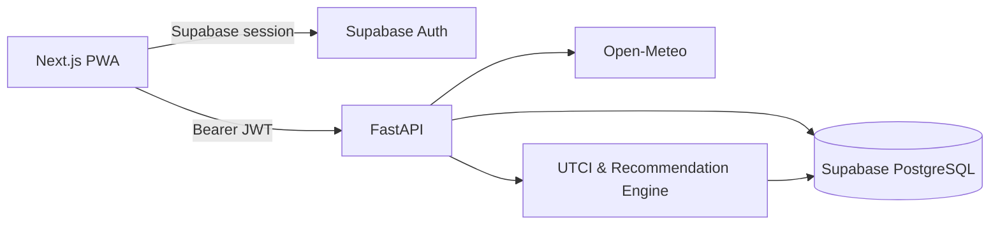

# PCRS

개인의 신체 특성, 활동 계획, 실내외 환경과 실제 체감 피드백을 반영해 옷차림과 활동 시간을 추천하는 기상 기반 개인화 서비스입니다.

**Live:** [pcrs-mu.vercel.app](https://pcrs-mu.vercel.app)

## 주요 기능

- 위치별 실시간·시간대별 기상 정보와 UTCI 기반 체감 분석
- 활동 강도와 실내외 환경을 반영한 옷차림 추천
- 사용자가 등록한 옷장을 우선 활용하는 개인화 조합
- `더웠어요 / 적당했어요 / 추웠어요` 피드백 기반 선호 보정
- 즐겨찾는 장소, 계정 데이터 내보내기와 삭제 요청
- 모바일 우선 PWA 인터페이스

## 기술 구성

| 영역 | 기술 |
|---|---|
| Frontend | Next.js, TypeScript, PWA, Vercel |
| Backend | FastAPI, Python, Pydantic |
| Data & Auth | Supabase PostgreSQL, Supabase Auth, RLS |
| Weather | Open-Meteo, 좌표 기반 예보 캐시 |
| Recommendation | UTCI, 활동·환경·체감 피드백 기반 규칙 모델 |
| Operations | Render, GitHub Actions |

## 구조

```text
PCRS/
├── frontend/       # Next.js 사용자 인터페이스
├── backend/        # FastAPI와 추천·기상·계정 API
├── batch/dags/     # 기상 데이터 수집 작업
├── PROJECT_SPEC.md # 제품·기술 설계 기준
└── render.yaml     # 백엔드 배포 설정
```

## 아키텍처



기상 API 호출은 정규화된 좌표 셀 단위로 캐시합니다. 추천 API는 기상 조건, 활동 강도, 사용자 프로필, 옷장과 체감 피드백을 결합해 결과와 근거를 함께 반환합니다. 사용자 데이터 테이블에는 RLS를 적용하고, 서버 전용 키는 백엔드 환경에서만 사용합니다.

## 로컬 실행

### Backend

```bash
cd backend
python -m venv .venv
# Windows: .venv\Scripts\activate
pip install -r requirements.txt
copy .env.example .env
uvicorn main:app --reload
```

### Frontend

```bash
cd frontend
npm ci
copy .env.example .env.local
npm run dev
```

환경변수 예시 파일에는 실제 인증정보를 입력하지 않습니다. 로컬 값은 Git에서 제외되는 `.env`와 `.env.local`에 설정합니다.

## 문서

- [제품 및 기술 설계](PROJECT_SPEC.md)
- [베타 배포 안내](BETA_DEPLOYMENT.md)
- [데이터베이스 마이그레이션](backend/migrations/README.md)

## 상태

현재 베타 버전으로 운영 중이며 추천 정확도, 좌표 기반 기상 캐시와 개인화 기능을 지속해서 개선하고 있습니다.
