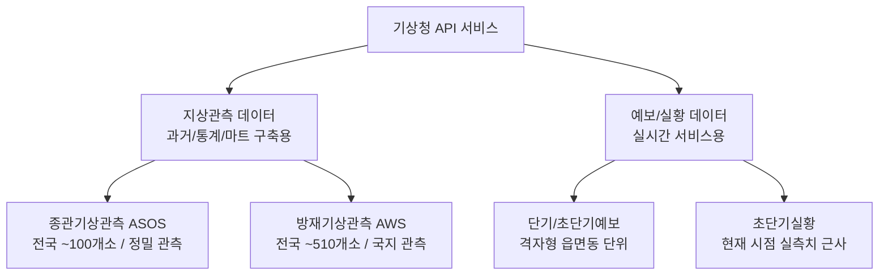
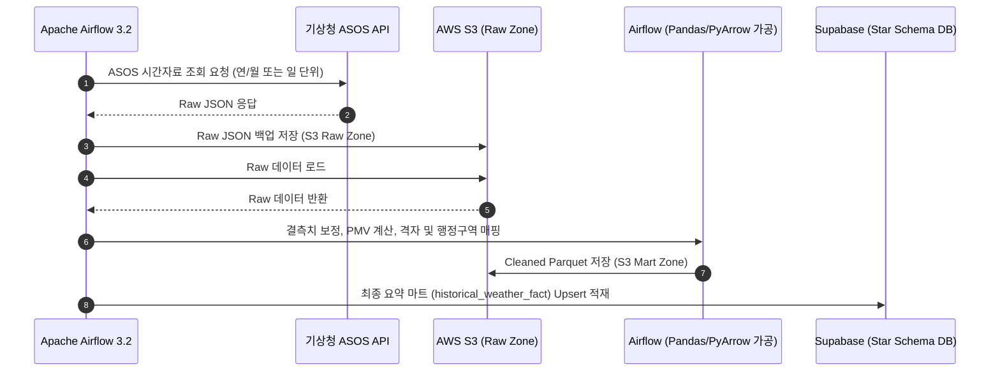

# 기상청 API 데이터 수집 및 S3 데이터 레이크 구축 검토 보고서

본 문서는 **개인 맞춤형 체감 열 부하 데이터 프로덕트 v2.0**의 요구사항인 10개년 기후 통계 분석(배치) 및 실시간 가이드 제공(실시간)을 위해, 기상청 API의 다양한 카테고리를 비교 분석하고 최적의 데이터 수집 방안을 제안합니다.

---

## 1. 체감 열 부하(PMV) 연산 및 의류 추천을 위한 핵심 기상 변수

체감 열 부하 지수인 **PMV(Predicted Mean Vote)** 및 개인 맞춤형 의류 추천을 계산하기 위해서는 다음과 같은 4대 물리적 환경 변수가 필수적입니다.

| 물리적 변수 | 필수 여부 | PMV 연산 반영 방식 | 기상청 제공 API 항목명 |
| :--- | :---: | :--- | :--- |
| **기온 (Air Temp)** | 필수 (High) | 대류 열전달 및 피부 온도 계산의 기본 요소 | 기온 (`ta` 또는 `T1H`) |
| **상대습도 (Humidity)** | 필수 (High) | 땀 증발 및 피부 습윤도 계산에 직접적 영향 | 상대습도 (`hm` 또는 `REH`) |
| **풍속 (Wind Speed)** | 필수 (High) | 피부 표면의 대류 열전달률을 제어하는 핵심 인자 | 풍속 (`ws` 또는 `WSD`) |
| **평균복사온도 (MRT)** | 필수 (High) | 태양 복사열 및 주변 환경 열복사를 계산하기 위해 필요 (일사량 데이터로 간접 유추) | 일사량 (`icsr` 또는 `RN1` 등으로 보조) |

---

## 2. 기상청 API 카테고리별 비교 분석

기상청 API는 관측 목적 및 장비 종류에 따라 크게 **지상관측(ASOS, AWS)**과 **수치예보/예보(단기/초단기)**로 분류됩니다.



### 2.1 지상관측: 종관기상관측(ASOS) vs 방재기상관측(AWS)

| 비교 항목 | 종관기상관측 (ASOS) | 방재기상관측 (AWS) |
| :--- | :--- | :--- |
| **주요 목적** | 기후 통계, 예보 분석, 대외 교류 등 공식 기후 자료 생산 | 지진, 태풍, 집중호우 등 방재용 국지 기상 감시 |
| **관측소 수** | 전국 약 102개 지점 (대표성 높음) | 전국 약 510개 지점 (촘촘한 밀도) |
| **제공 변수** | **기온, 습도, 풍속, 강수량, 일조량, 일사량, 적설량 등 대다수 기상 인자 포함** | **기온, 풍속, 강수량 위주** (일사량, 일조량, 습도 누락 지점 다수) |
| **과거 보유 기간** | 수십 년 전 자료부터 완비 (10개년 데이터 아카이빙 가능) | 지점별 상이하며 결측률이 ASOS 대비 높음 |
| **추천 용도** | **[적합] 과거 10개년 기후 데이터 마트 구축 (S3 + Airflow Batch)** | **[부적합] PMV 계산에 필요한 습도, 일사량 정보 부족** |

> [!IMPORTANT]
> **ASOS**는 관측 지점 수는 적으나 **습도, 풍속, 일사량** 등 PMV 계산에 반드시 필요한 4대 변수를 모두 완벽하게 제공하므로, **10개년 배치 적재용 데이터 레이크 구축의 메인 소스**로 선정합니다.

### 2.2 예보/실황: 실시간 서비스용 데이터

사용자가 앱에 접속했을 때의 실시간 체감 온도 가이드를 제공하기 위해서는 관측소 기준이 아닌 **행정구역/격자 좌표 기준**의 실시간 날씨 데이터가 필요합니다.

* **초단기실황 (기상청 단기예보 서비스)**: 1시간 단위로 실측된 전국 날씨 데이터를 읍면동 격자 단위로 보간하여 제공합니다. 실시간 사용자 위치 매핑에 가장 유리합니다.
* **초단기예보 / 단기예보**: 향후 수 시간 및 수 일간의 예측 기온, 습도, 풍속 등을 제공하여 대시보드의 "시간대별 체감 분석" 기능을 구현하는 데 필수적입니다.

---

## 3. 최종 API 선정 및 수집 전략 제안

프로젝트의 요구사항인 1차 목표 **"API 결과를 S3로 수집"** 및 **"개인화 의류 추천 반영"**을 위해 이원화된 수집 전략을 제안합니다.

### 1) 배치 수집 (과거 10개년 데이터 레이크 아카이빙)
* **대상 API**: 기상청 종관기상관측(ASOS) 시간자료 조회 서비스
* **수집 주기**: 연/월 단위 벌크 수집 (과거 10년분) 및 매일 새벽 전일(D-1) 데이터 증분 업데이트
* **저장 위치**: AWS S3 (Raw JSON/CSV -> Parquet 포맷 변환 후 저장)

### 2) 실시간 서빙 및 캐싱 (FastAPI Backend)
* **대상 API**: 기상청 단기예보(초단기실황 및 단기예보) 조회 서비스
* **수집 방식**: 사용자 접속 시 좌표(nx, ny) 기준 기상청 API 호출 -> Supabase 캐시(TTL 1시간) 적재 및 활용
* **장점**: 기상청 API 호출 제한(Rate Limit)을 피하고 빠른 응답 속도를 유지

---

## 4. S3 데이터 레이크 수집 아키텍처 (1차 목표)

Airflow 3.2 배치를 통해 기상청 ASOS API 결과를 S3로 적재하는 구체적인 아키텍처와 디렉터리 구조 설계안입니다.

### 4.1 S3 디렉터리 (Bucket) 레이아웃 설계

S3 버킷 내에 **Raw Zone(원본 데이터)**과 **Cleaned/Mart Zone(가공 데이터)**을 명확히 구분하여 보관합니다.

```
s3://personalized-clothing-recommendation-datalake/
├── raw/
│   └── weather/
│       └── asos/
│           ├── year=2016/
│           │   ├── month=01/
│           │   │   └── data.json
│           │   └── ...
│           └── year=2026/
│               └── month=06/
│                   └── 2026-06-29.json  <-- 일일 증분(Daily Incremental) 데이터
└── cleaned/
    └── weather_summary_mart/
        └── year=2016_2026_aggregated.parquet  <-- Airflow가 대규모 집계 연산 후 Supabase 적재용으로 포맷팅한 데이터
```

### 4.2 데이터 파이프라인 흐름 (Airflow 3.2)



---

## 5. 향후 구현을 위한 개발 액션 아이템 (Action Items)

1. **기상청 API 허브 (또는 공공데이터포털) 인증키 준비 및 `.env` 설정**
   * ASOS 시간자료 조회 API 및 단기예보 API 활용 신청 완료 필요
2. **Airflow DAG (`asos_collect_dag.py`) 구체화**
   * 기상청 API의 호출 룰(예: 한 번에 조회 가능한 최대 기간 제한 등)을 반영한 페이지네이션 및 청크 분할 수집 로직 작성
   * `boto3`를 활용한 S3 적재 로직 연동
3. **Supabase 연동 및 Star Schema 마트 테이블 생성**
   * `historical_weather_fact` 및 `region_dimension` 테이블 DDL 실행 및 매핑 구조 확립
4. **PMV 연산 라이브러리 검증**
   * `pythermalcomfort` 라이브러리를 배치 가공 단계에 이식하여 과거 10개년 기온/습도/풍속 기준 시간대별 PMV 통계값 산출 로직 구현

---

위 검토 결과에 대해 피드백을 주시면, 이를 기반으로 **S3 적재 로직이 포함된 Airflow DAG 고도화 및 DB 연동 스크립트 작성**을 구체화하겠습니다.
